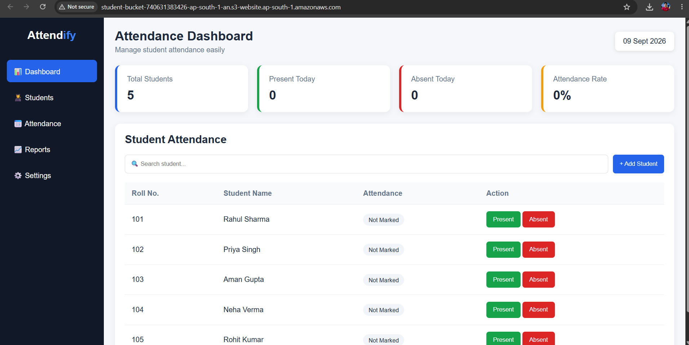
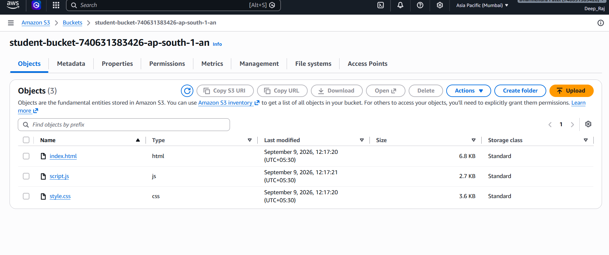
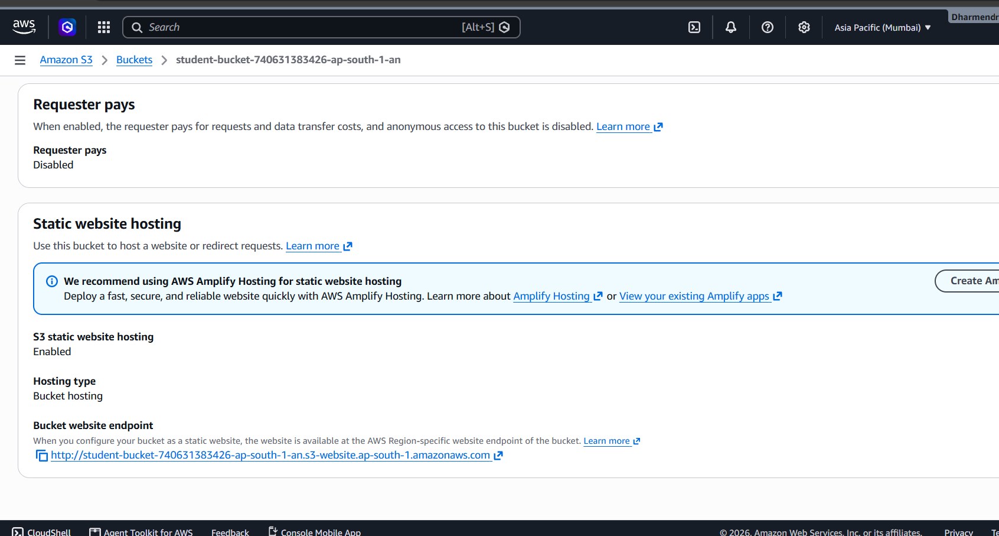

# 📊 Attendify – Attendance Management System

A simple and professional **web-based Attendance Management System** for managing student attendance quickly and easily.

## 🌐 Live Demo

The project is hosted using **Amazon S3 Static Website Hosting**.

**Live Website:**  
https://student-bucket-740631383426-ap-south-1-an.s3-website.ap-south-1.amazonaws.com/

## 📌 Project Description

**Attendify** is a frontend-based Attendance Management System built to simplify daily student attendance management.

### Main features
- 📊 Attendance dashboard
- 👨‍🎓 Student management
- ✅ Mark Present
- ❌ Mark Absent
- 🔎 Search students
- ➕ Add students
- 📈 Attendance rate calculation
- 📅 Current date display
- 📱 Responsive user interface
- ☁️ Amazon S3 static website hosting

## 🛠️ Technologies Used

- **HTML5** – Website structure
- **CSS3** – Styling and responsive design
- **JavaScript** – Attendance logic and interactions
- **Git & GitHub** – Version control
- **Amazon S3** – Static website hosting

## 📁 Project Structure

```text
Attendance-Management-System/
│
├── index.html
├── style.css
├── script.js
├── README.md
└── screenshots/
    ├── dashboard.png
    ├── s3-bucket.png
    └── live-website.png
```

## 🖥️ Screenshots

### Attendance Dashboard



### Amazon S3 Bucket



### Live Website



## ☁️ AWS Deployment

The website is deployed using **Amazon S3 Static Website Hosting**.

### Deployment steps

1. Create an S3 bucket.
2. Upload `index.html`, `style.css`, and `script.js`.
3. Enable Static Website Hosting.
4. Set `index.html` as the index document.
5. Configure the required bucket access/settings.
6. Open the S3 website endpoint.

## 🚀 Run Locally

Clone the repository:

```bash
git clone https://github.com/Himanshu-who/Attendance-Management-System.git
```

Then open the project in VS Code and run `index.html` using Live Server.

## 🔮 Future Improvements

- Admin and student login
- Database integration
- Attendance history
- Monthly attendance reports
- PDF/Excel export
- AWS DynamoDB or RDS
- AWS Lambda + API Gateway
- Amazon Cognito authentication
- CloudWatch monitoring
- Role-based access control

## 👨‍💻 Project Information

**Project Name:** Attendance Management System  
**Application Name:** Attendify  
**Type:** Web Application / Static Website  
**Hosting:** Amazon S3  
**AWS Region:** Asia Pacific (Mumbai)

## 📄 License

This project is created for educational and academic purposes.
